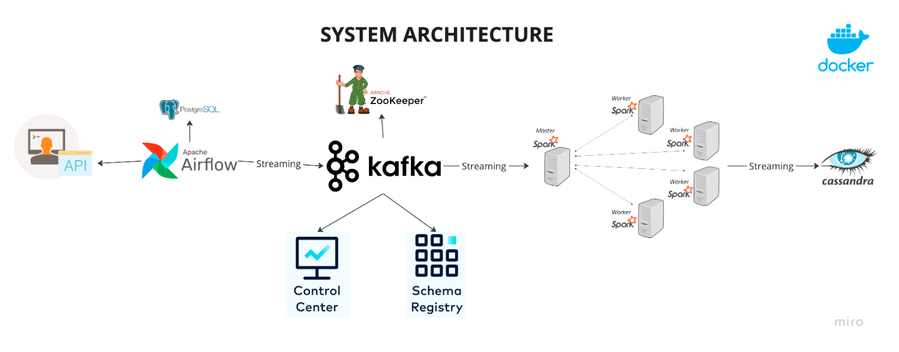

## Introduction

This project serves is to build an end-to-end data engineering pipeline. It covers each stage from data ingestion to processing and finally to storage, utilizing a robust tech stack that includes Apache Airflow, Python, Apache Kafka, Apache Zookeeper, Apache Spark, and Cassandra. Everything is containerized using Docker for ease of deployment and scalability.

The project is designed with the following components:

- **Data Source**: Use `randomuser.me` API to generate random user data for our pipeline.
- **Apache Airflow**: Responsible for orchestrating the pipeline and storing fetched data in a PostgreSQL database.
- **Apache Kafka and Zookeeper**: Used for streaming data from PostgreSQL to the processing engine.
- **Control Center and Schema Registry**: Helps in monitoring and schema management of our Kafka streams.
- **Apache Spark**: For data processing with its master and worker nodes.
- **Cassandra**: Where the processed data will be stored.

